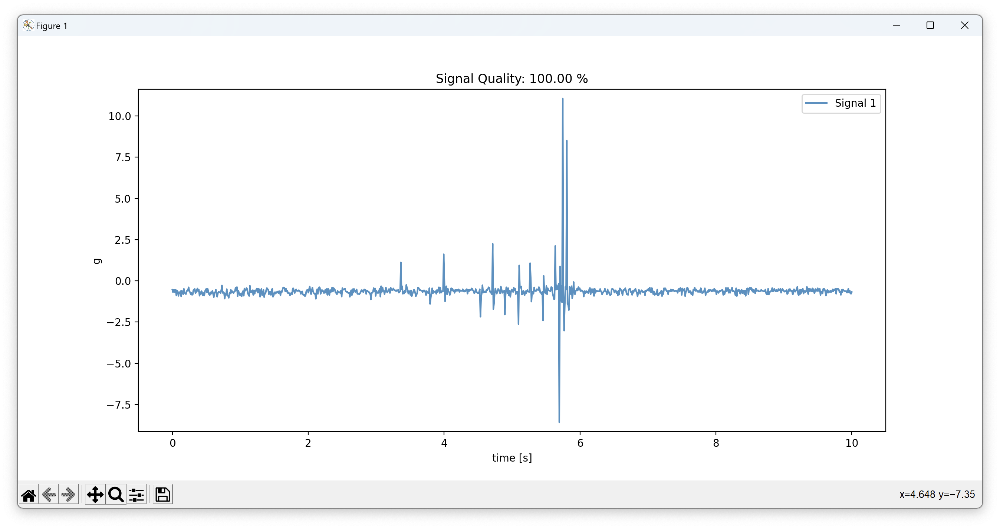
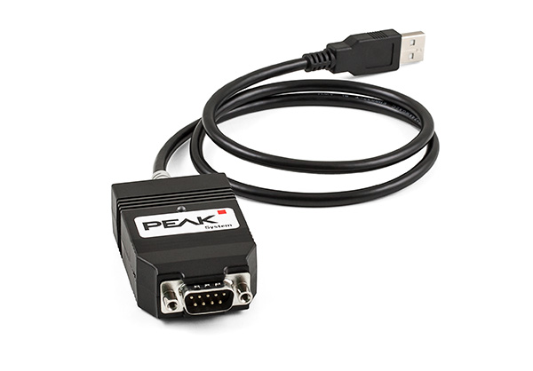
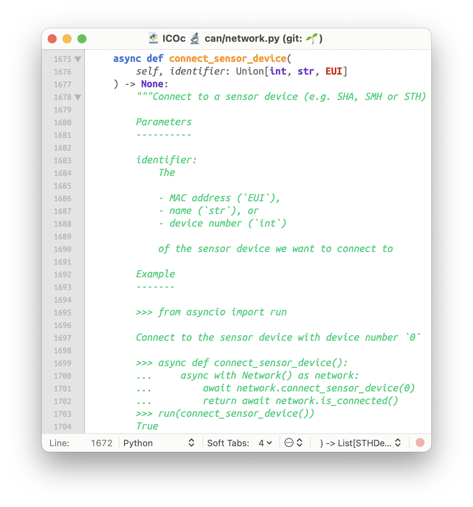

# ICOc (Library) Intro


---

# 🍱 ICOc Parts

- **Library** (folder `mytoolit`)
  - „Old Code“
    - Folder `mytoolit.old`
    - Only Windows support
  - „New Code“
    - Everything else in `mytoolit`
    - Works on Linux & macOS too
- **Command Line Tools**
  - [`icoc`](https://mytoolit.github.io/ICOc/#basic-usage): UI for measurement
    - Uses “old” parts of library
  - [`icon`](https://mytoolit.github.io/ICOc/#icon-cli-tool): New but **very basic** tool



---

# 📚 Library – 🏚️ Old

```py
from mytoolit.old import …
```

- Based on [PCAN Python library](https://pypi.org/project/python-can/)
- Only works with **PEAK-System CAN** adapter
- Only works on **Windows**
- 🚫 Please do not use
- 🗑️ Will (hopefully 😅) be removed in future



---

# 📚 Library – ✨ New

```py
from mytoolit.can.network import …
from mytoolit.measurement import …
```

- Based on [`python-can`](https://pypi.org/project/python-can/)
- Multi OS support (Linux, macOS, Windows)
- Support for different CAN adapters (Untested)


---

# 💻 Read STH Name

```py
"""Read name of STH with device number 0"""

from asyncio import run

from mytoolit.can import Network

async def read_name(identifier):
    async with Network() as network:
        await network.connect_sensor_device(identifier)
        name = await network.get_name("STH 1")
        print(f"Connected to sensor device “{name}”")

if __name__ == "__main__":
    # Possible Identifiers:
    # - Name:          e.g. `"Test-STH"`
    # - Device Number: e.g. `1`
    # - MAC Address:   e.g. `netaddr.EUI('08-6B-D7-01-DE-81')`
    run(read_name(identifier=0))
```

```
Connected to sensor device “Test-STH”
```

---

# 💻 Read Acceleration (Streaming) Data

```py
"""Read some acceleration data of STH with device name Test-STH"""

from asyncio import run

from mytoolit.can import Network

async def read_name(identifier):
    async with Network() as network:
        await network.connect_sensor_device(identifier)

        # Read data of first channel
        async with network.open_data_stream(first=True) as stream:
            messages = 5
            async for data in stream:
                print(f"Read data values: {data.first}")
                messages -= 1
                if messages <= 0:
                    break

if __name__ == "__main__":
    run(read_name(identifier="Test-STH"))
```

---

# 💻 Read Acceleration Data Output (Formatted)

```
Read data values: [32545@1699449268.487127 (65),
                   32663@1699449268.487127 (65),
                   32491@1699449268.487127 (65)]
Read data values: [32636@1699449268.487309 (66),
                   32540@1699449268.487309 (66),
                   32666@1699449268.487309 (66)]
Read data values: [32569@1699449268.487493 (67),
                   32642@1699449268.487493 (67),
                   32547@1699449268.487493 (67)]
Read data values: [32614@1699449268.487677 (68),
                   32513@1699449268.487677 (68),
                   32644@1699449268.487677 (68)]
Read data values: [32524@1699449268.488246 (69),
                   32626@1699449268.488246 (69),
                   32551@1699449268.488246 (69)]
```

---

# 💻 Other Code References

- No (HTML) library documentation 😢 (Sorry)
- Check **docstrings of [`Network` class`](https://github.com/MyTooliT/ICOc/blob/master/mytoolit/can/network.py)**
- Check [source code of `icon`](https://github.com/MyTooliT/ICOc/blob/master/mytoolit/cmdline/icon.py)



---

# 🛟 Support/Questions

- [ICOc Documentation](https://mytoolit.github.io/ICOc/): `https://mytoolit.github.io/ICOc/`
- [Issue Tracker of ICOc](https://github.com/MyTooliT/ICOc/issues): `https://github.com/MyTooliT/ICOc/issues`
- [This Slide Deck](https://github.com/MyTooliT/ICOc-Library-Introduction): `https://github.com/MyTooliT/ICOc-Library-Introduction`
- Ask me now 🙂

---

# ℹ️ Sources

- [Python-Logo](https://commons.wikimedia.org/wiki/File:Python-logo-notext.svg)
